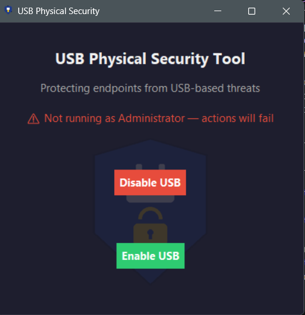
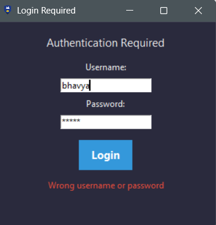
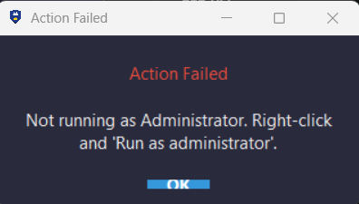
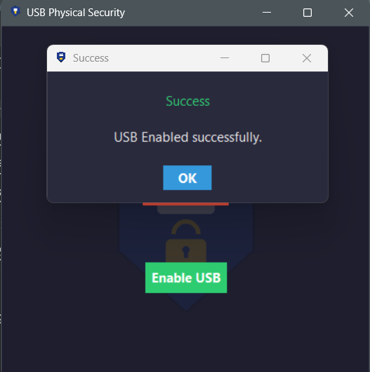

# USB Physical Security Tool

A Windows-based endpoint security tool that provides authenticated control over USB storage access, built as part of my cybersecurity internship at Supraja Technologies.

## Overview

USB drives are one of the most common and underestimated attack vectors in corporate environments — capable of delivering malware, enabling data exfiltration, and bypassing traditional network-based defenses entirely. This tool implements a simple but effective form of **device control**: the same category of endpoint security control used in enterprise tools like Microsoft Defender for Endpoint and various DLP (Data Loss Prevention) products.

The tool allows an authenticated user to enable or disable USB storage access on a Windows machine through a clean GUI, backed by proper authentication and audit logging.

## Features

- **USB Storage Control** — Enable/disable USB storage at the OS level via the Windows Registry (`HKLM\SYSTEM\CurrentControlSet\Services\USBSTOR`)
- **Authenticated Access** — Multi-user login system with salted **PBKDF2-HMAC-SHA256** password hashing (260,000 iterations) instead of plaintext or unsalted hashes
- **Constant-Time Comparison** — Uses `hmac.compare_digest()` to prevent timing-based attacks during password verification
- **Account Lockout** — Automatic 15-minute lockout after repeated failed login attempts, mitigating brute-force attempts
- **Administrator Privilege Verification** — Detects and warns if the tool isn't running with the elevated permissions required for registry modification
- **Audit Logging** — Every security-relevant event (login attempts, successes, failures, lockouts, USB state changes) is timestamped and logged to `usb_security.log`
- **Polished UI** — Custom splash screen, application icon, and a layered canvas-based interface built with Tkinter

## How It Works

USB storage on Windows is governed by a single registry value:
HKLM\SYSTEM\CurrentControlSet\Services\USBSTOR
Start = 3   →  Enabled
Start = 4   →  Disabled
The application automates changing this value via `subprocess`-invoked `reg add` commands, gated behind an authentication layer so that only verified users can trigger the change.

## Screenshots

**Main Window**
Displays a warning if the tool isn't running with Administrator privileges, since registry modification requires elevation.



**Authentication Required**
Every USB state change is gated behind login. Failed attempts are logged and count toward the account lockout threshold.



**Error Handling**
The tool correctly detects and reports when it lacks the privileges needed to modify the registry, rather than failing silently.



**Successful Operation**
Confirmation shown after a USB state change completes successfully.



## Tech Stack

- **Language:** Python 3
- **GUI:** Tkinter
- **Security:** `hashlib` (PBKDF2-HMAC-SHA256), `hmac`, `os.urandom` (salting)
- **System Integration:** `subprocess`, `ctypes` (admin privilege check)
- **Packaging:** PyInstaller (standalone `.exe`)

## Requirements

- Windows OS
- Python 3.9+ (developed/tested on Python 3.14)
- Administrator privileges (required to modify the registry)

## Running the Project

```bash
python code.py
```

**Note:** Must be run as Administrator, or registry changes will silently fail — the app will detect this and display a warning if elevated permissions aren't present.

## Building a Standalone Executable

```bash
python -m PyInstaller --onefile --windowed --icon=usb_security_logo.ico --name "USB Physical Security" code.py
```

Ensure `usb_security_logo.png` and `logo_faded.png` are placed in the same directory as the generated `.exe`, as they are loaded at runtime.

## Known Limitations / Future Improvements

- Credentials are currently defined in source rather than loaded from a secure external store or environment variables
- Whitelisting of specific USB devices by Vendor ID/Product ID/Serial Number is a planned enhancement, allowing granular device-level control rather than an all-or-nothing toggle
- Currently single-machine scoped; no centralized logging or alerting across multiple endpoints

## Acknowledgment

Developed as part of the Ethical Hacking / Web Application VAPT internship at **Supraja Technologies**, under the guidance of Upendra (Senior Security Analyst) and Krishna (Security Analyst).

## Author

**Annabattula Sai Bhavya Sri**
B.Tech CSE (Cybersecurity), Andhra University College of Engineering
[LinkedIn](https://linkedin.com/in/bhavya-annabattula-692112320) | [Portfolio](https://bhavya-annabattula.github.io/Portfolio/)
